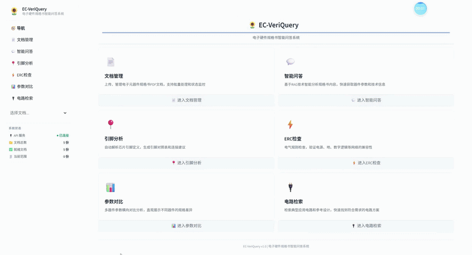
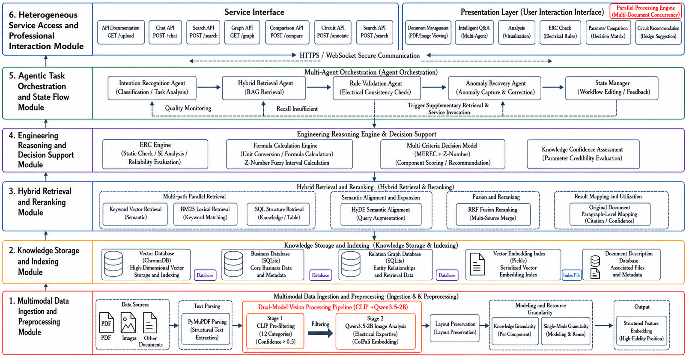

<p align="center">
  
  
  
</p>

<h1 align="center">Veriquery</h1>

<p align="center"><em>Multimodal Agentic RAG with Graph-Enhanced Knowledge Base<br>for Hardware Datasheet Intelligent Q&amp;A and Verification System</em></p>

<p align="center">
  <a href="README_zh.md"></a>
</p>

---

## Demo

<p align="center">
  
</p>

<p align="center">
  <a href="https://github.com/FinalSunFlower/Veriquery/issues/2">📹 Watch Demo Video</a>
</p>

## 🎯 Overview

Veriquery is an end-to-end intelligent system for electronic component datasheet analysis, built on Multimodal Agentic RAG, knowledge graph enhancement, and formal reasoning engines. It transforms static PDF datasheets into queryable knowledge, enabling engineers to retrieve parameters, verify electrical compatibility, compare devices, and locate reference circuits through natural language interaction.

The system addresses a critical gap in electronic design workflows: the manual, error-prone process of extracting and cross-referencing specifications from heterogeneous datasheets. VeriQuery automates this pipeline with a hybrid retrieval architecture, a four-layer Electrical Rule Check (ERC) engine, and a Z-number augmented multi-criteria decision framework.

Unlike general-purpose RAG systems, VeriQuery is purpose-built for the datasheet domain — every core module incorporates domain-specific design: the ERC engine encodes JEDEC logic-level standards and Arrhenius thermal degradation models; the parameter extractor uses section-anchored regex targeting "Electrical Characteristics" tables; the hybrid retriever adds a structured path (SQLite FTS5) specifically to preserve tabular data integrity; and the scoring engine normalizes test conditions via semiconductor physics (CCM) rather than generic min-max scaling.

## ✨ Key Features

| Module | Capability | Technology |
|--------|-----------|------------|
| **Intelligent Q&A** | Natural language queries over datasheet content with citation tracing | Agentic RAG + LangGraph + Hybrid Retrieval |
| **Pinout Analysis** | Automatic pin definition extraction and SVG diagram rendering | Knowledge Graph + Regex + LLM |
| **ERC Check** | Four-layer progressive electrical compatibility verification | Interval Arithmetic + JEDEC Standards |
| **Parameter Comparison** | Multi-device scoring with reliability-aware ranking | Z-number + B-SPOTIS + MEREC |
| **Circuit Retrieval** | Multi-modal circuit diagram search from PDF pages | CLIP + VLM + MaxSim |
| **Document Management** | PDF upload, parsing, indexing, and lifecycle management | PyMuPDF + Camelot + pdfplumber |

## 🏗️ System Architecture

<p align="center">
  
</p>

## Core Algorithms

### Hybrid Retrieval with RRF Fusion

Three heterogeneous retrieval paths execute concurrently, with results merged via Reciprocal Rank Fusion (Cormack et al., 2009):

```text
score(d) = Σ_s w_s × 1/(k + rank_s(d) + 1),  k=60
```

| Path | Method | Weight | Strength |
|------|--------|--------|----------|
| Dense | Sentence-Transformer + ChromaDB (HNSW) | 0.50 | Semantic similarity |
| Sparse | BM25 + jieba tokenization | 0.35 | Exact keyword match |
| Structured | SQLite FTS5 + table store | 0.15 | Preserves table structure |

All three paths execute concurrently via `asyncio.gather` with `return_exceptions=True`. Total latency equals `max(T1, T2, T3)` instead of `T1+T2+T3`. Individual path failures are tolerated — remaining paths still return results.

### Four-Layer ERC Engine

Progressive detection architecture for electrical compatibility verification:

| Layer | Detection | Method | Reference |
|-------|-----------|--------|-----------|
| L1 | Static Stability | JEDEC logic level + noise margin | JESD8 series |
| L2 | Signal Integrity | Transmission line reflection analysis | Bogatin, E. |
| L3 | Topology Conflict | Interface protocol + port attribute matrix | IEEE 1801 UPF |
| L4 | Environmental Degradation | Interval arithmetic + Arrhenius model | Moore (1966), JESD22-A108D |

Layer 4 uses `Interval(lo, hi)` primitives for uncertainty propagation through arithmetic operations, modeling temperature drift where electrical parameters expand from crisp values to intervals.

### Three-Layer Parameter Scoring (CCM + Z-A-FoM + B-SPOTIS)

| Layer | Function | Method |
|-------|----------|--------|
| CCM | Test condition normalization | Semiconductor physics linear equivalent conversion |
| Z-A-FoM | Reliability fusion | Z-number (Zadeh, 2011) + Kang conversion |
| B-SPOTIS | Robust decision | MEREC objective weighting + SPOTIS (Dezert et al., 2020) |

### Three-Stage Parameter Extraction

Cascaded pipeline with decreasing confidence:

1. **Structured Table Query** — Direct lookup from extracted PDF tables (confidence: ~0.93)
2. **Section-Anchored Regex** — Pattern matching within "Electrical Characteristics" sections (confidence: 0.73–0.85)
3. **Few-Shot LLM Verification** — Targeted LLM extraction for remaining parameters (confidence: ~0.80)

Each stage processes only parameters missed by prior stages (cascaded fallback), ensuring high-confidence results are preserved first.

## 🚧 Performance & Evaluation (In Progress)

The quantitative evaluation of Veriquery is currently underway. We are conducting comprehensive benchmark tests across the following dimensions, and the detailed experimental results will be published in our upcoming academic paper:

- **Extraction Accuracy:** Evaluating the F1-score of our cascaded parameter extraction pipeline against baseline LLMs (e.g., direct prompt-based extraction).
- **Retrieval Robustness:** Measuring the Recall@K improvements brought by the RRF hybrid retrieval strategy on heterogeneous datasheet PDFs.
- **Reasoning Reliability:** Validating the accuracy of the 4-layer ERC engine against standard JEDEC/IEEE edge-case scenarios.

*Stay tuned for the full technical report and evaluation dataset.*

<details>
<summary>📁 Project Structure</summary>

```text
veriquery/
├── api/                        # FastAPI backend
│   ├── main.py                 # Application entry, lifespan, middleware
│   ├── dependencies.py         # Service container, dependency injection
│   ├── error_handlers.py       # Global exception handlers
│   └── routers/
│       ├── chat.py             # Intelligent Q&A endpoints
│       ├── circuit.py          # Circuit retrieval endpoints
│       ├── compare.py          # Device comparison endpoints
│       ├── documents.py        # Document management endpoints
│       ├── erc.py              # ERC check endpoints
│       └── pinout.py           # Pinout analysis endpoints
├── agents/                     # LangGraph agent workflow
│   ├── workflow_graph.py       # DAG topology and intent routing
│   ├── workflow_nodes.py       # Intent routing, retrieval, generation
│   ├── comparison_node.py      # Multi-device comparison orchestration
│   └── erc_node.py             # ERC check orchestration
├── core/                       # Shared infrastructure
│   ├── config.py               # Pydantic Settings, singleton configuration
│   ├── schema.py               # Unified data models (AgentState, PinInfo, etc.)
│   ├── llm_client.py           # HuggingFace LLM client with quantization
│   ├── svg_renderer.py         # Pinout SVG diagram renderer
│   ├── memory_manager.py       # GPU memory management
│   ├── model_manager.py        # Model lifecycle management
│   ├── cleanup_manager.py      # Orphan data cleanup
│   ├── sqlite_utils.py         # SQLite health check and repair
│   └── exceptions.py           # Custom exception hierarchy
├── ingestion/                  # Document processing pipeline
│   ├── document_processor.py   # PDF parsing, CLIP filtering, table orchestration
│   └── image_indexer.py        # CLIP + VLM + MaxSim visual indexing
├── extraction/                 # Parameter and table extraction
│   ├── parameter_extractor.py  # Three-stage cascaded parameter extraction
│   └── table_extractor.py      # Three-layer table extraction (Camelot/pdfplumber)
├── retrieval/                  # Hybrid retrieval subsystem
│   ├── hybrid_retriever.py     # RRF fusion orchestrator
│   ├── vector_store.py         # ChromaDB dense retrieval
│   ├── bm25_store.py           # BM25 sparse retrieval
│   ├── table_store.py          # SQLite FTS5 structured retrieval
│   └── embeddings.py           # Sentence-Transformer embedding service
├── reasoning/                  # Formal reasoning engines
│   ├── erc_engine.py           # Four-layer ERC with interval arithmetic
│   └── parameter_scorer.py     # CCM + Z-A-FoM + B-SPOTIS scoring
├── knowledge/                  # Domain knowledge base
│   ├── graph_db.py             # SQLite knowledge graph schema (chips→pins→parameters)
│   ├── graph_query.py          # Knowledge graph query engine (3-level fallback)
│   ├── chip_importer.py        # Chip data import pipeline
│   └── pinout_library.py       # Built-in common chip pinout database
├── ui/                         # Streamlit frontend
│   ├── app.py                  # Main page with navigation cards
│   ├── api_client.py           # Backend API client
│   ├── theme.py                # Academic-style CSS theme
│   ├── sidebar_nav.py          # Sidebar navigation and document selector
│   └── pages/
│       ├── 1_Documents.py      # Document management page
│       ├── 2_Chat.py           # Intelligent Q&A page
│       ├── 3_Pinout.py         # Pinout analysis page
│       ├── 4_ERC.py            # ERC check page
│       ├── 5_Compare.py        # Parameter comparison page
│       └── 6_Circuit.py        # Circuit retrieval page
├── docs/                       # Screenshots and documentation assets
├── data/                       # Runtime data (gitignored)
├── pyproject.toml              # Project metadata and build config
├── requirements.txt            # Python dependencies
├── .env.example                # Environment variable template
├── logging.yaml                # Logging config template (reference)
└── start.ps1                   # Windows startup script
```

</details>

## 🛠️ Tech Stack

| Category | Technology | Purpose |
|----------|-----------|---------|
| **Backend Framework** | FastAPI + Uvicorn | Async REST API with OpenAPI docs |
| **Frontend Framework** | Streamlit | Multi-page interactive UI |
| **Agent Workflow** | LangGraph | DAG-based stateful workflow orchestration |
| **LLM** | Qwen3.5 (HuggingFace) | Local inference with 4-bit quantization, natively multimodal |
| **VLM** | Qwen3.5 (HuggingFace) | Natively multimodal model for diagram understanding |
| **Embedding** | BGE / Qwen-Embedding (HuggingFace) | Dense text vectorization (1024-dim) |
| **Vector DB** | ChromaDB | HNSW approximate nearest neighbor search |
| **Sparse Retrieval** | rank_bm25 + jieba | BM25 keyword matching with Chinese tokenization |
| **Structured Retrieval** | SQLite + FTS5 | Full-text search over table data |
| **PDF Processing** | PyMuPDF + pdfplumber + Camelot | Text extraction, table extraction, image rendering |
| **Vision** | CLIP + PIL | Image classification and filtering |
| **Knowledge Graph** | SQLite | Chip-pin-parameter relational storage |
| **Configuration** | Pydantic Settings | Type-safe env-based configuration |
| **Logging** | Python logging + RotatingFileHandler | Structured logging with rotation |

## 🚀 Getting Started

### Prerequisites

- Python 3.10+
- CUDA-capable GPU (recommended, 4GB+ VRAM for minimum models)
- Git

### Installation

```bash
git clone https://github.com/FinalSunFlower/Veriquery.git
cd veriquery

python -m venv .venv

# Windows:
.venv\Scripts\activate
# Linux/macOS:
source .venv/bin/activate

pip install -r requirements.txt
```

### Model Setup

All models are **automatically downloaded from HuggingFace** on first run. No manual download required. Configure which models to use in `.env`:

```bash
cp .env.example .env
```

| Model | Config Key | Default | VRAM | Purpose |
|-------|-----------|---------|------|---------|
| LLM | `LLM_MODEL` | `Qwen/Qwen3.5-0.8B` | ~1GB | Text generation (natively multimodal) |
| VLM | `VLM_MODEL` | `Qwen/Qwen3.5-2B` | ~2GB | Diagram understanding (natively multimodal) |
| Embedding | `EMBEDDING_MODEL` | `BAAI/bge-large-zh-v1.5` | ~1GB | Text vectorization |
| CLIP | `CLIP_MODEL` | `openai/clip-vit-base-patch32` | ~0.5GB | Image classification |

**VRAM recommendations by GPU:**

| GPU VRAM | Recommended LLM | Recommended VLM |
|----------|----------------|-----------------|
| 4GB | `Qwen/Qwen3.5-0.8B` | `Qwen/Qwen3.5-0.8B` |
| 8GB | `Qwen/Qwen3.5-2B` | `Qwen/Qwen3.5-2B` |
| 12GB+ | `Qwen/Qwen3.5-4B` | `Qwen/Qwen3.5-4B` |

> **Tip:** If you have limited VRAM, set `EMBEDDING_DEVICE=cpu` and `LLM_QUANTIZE=true` in `.env`.

### Launch

**Windows (automated):**

```powershell
.\start.ps1
```

**Manual start:**

```bash
# Terminal 1: Start backend API
python -m api.main

# Terminal 2: Start frontend UI
streamlit run ui/app.py --server.port 8501
```

**Access the application:**

- Frontend: http://localhost:8501
- Backend API: http://localhost:8000
- API Documentation: http://localhost:8000/docs
- Health Check: http://localhost:8000/health

### Quick Start Guide

1. **Upload a datasheet** — Navigate to the Documents page and upload a PDF datasheet (e.g., NE5532, LM358)
2. **Ask questions** — Go to Chat and type natural language queries like "NE5532 supply voltage range?"
3. **View pinouts** — Use the Pinout page to see automatically generated SVG pin diagrams
4. **Run ERC** — Check electrical compatibility between driver and receiver chips
5. **Compare devices** — Select multiple devices for parameter comparison with scoring
6. **Find circuits** — Search for application circuit diagrams from uploaded datasheets

<details>
<summary>🔌 API Reference</summary>

The backend exposes RESTful endpoints under `/api/v1`:

| Endpoint | Method | Description |
|----------|--------|-------------|
| `/api/v1/documents/` | GET | List documents |
| `/api/v1/documents/upload` | POST | Upload document |
| `/api/v1/chat/` | POST | Intelligent Q&A with RAG |
| `/api/v1/chat/stream` | POST | Streaming Q&A response |
| `/api/v1/pinout/` | POST | Pin definition extraction |
| `/api/v1/erc/check` | POST | Four-layer ERC compatibility check |
| `/api/v1/compare/devices-enhanced` | POST | Multi-device parameter comparison |
| `/api/v1/circuit/search` | POST | Multi-modal circuit diagram search |
| `/health` | GET | System health check |

Full interactive documentation is available at `/docs` (Swagger UI) and `/redoc` (ReDoc).

</details>

## 🔧 Configuration Reference

All configuration is managed through environment variables (`.env` file), with sensible defaults in `core/config.py`. Key configuration groups:

| Group | Key Variables | Default |
|-------|--------------|---------|
| **LLM** | `LLM_MODEL`, `LLM_DEVICE`, `LLM_QUANTIZE` | Qwen/Qwen3.5-0.8B, cuda, true |
| **VLM** | `VLM_MODEL`, `VLM_QUANTIZE` | Qwen/Qwen3.5-2B, true |
| **Embedding** | `EMBEDDING_MODEL`, `EMBEDDING_DIMENSION` | BAAI/bge-large-zh-v1.5, 1024 |
| **Retrieval** | `VECTOR_WEIGHT`, `BM25_WEIGHT`, `STRUCTURED_WEIGHT` | 0.50, 0.35, 0.15 |
| **Chunking** | `CHUNK_SIZE`, `CHUNK_OVERLAP` | 800, 200 |
| **Storage** | `CHROMA_PERSIST_DIR`, `DATA_DIR` | ./data/chroma, ./data |

See `.env.example` for the complete list of configurable parameters.

## 💡 Design Principles

- **Citation Tracing** — Every factual statement carries a source citation (file, page, text snippet) for verification
- **Graceful Degradation** — Each subsystem initializes independently; single component failure does not crash the system
- **Lazy Loading** — GPU models load on first use, avoiding startup memory pressure
- **Async Concurrency** — Retrieval paths execute concurrently via `asyncio.gather`; total latency = max(T1, T2, T3)
- **Singleton Pattern** — Thread-safe model instances via double-checked locking
- **Configuration Validation** — Pydantic validates all settings at startup with clear error messages

## Citation

If you use VeriQuery in your research, please cite:

```bibtex
@misc{veriquery2026,
  author       = {VeriQuery Team},
  title        = {VeriQuery: Multimodal Agentic RAG with Graph-Enhanced Knowledge Base for Hardware Datasheet Intelligent Q\&A and Verification System},
  year         = {2026},
  publisher    = {GitHub},
  journal      = {GitHub repository},
  howpublished = {\url{https://github.com/FinalSunFlower/Veriquery}}
}
```

## License

This project is licensed under the MIT License — see the [LICENSE](LICENSE) file for details.
