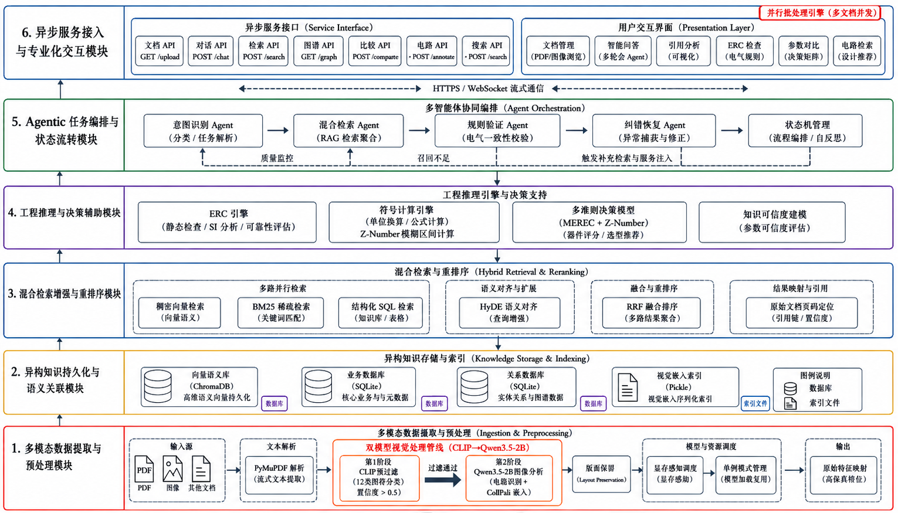

<p align="center">
  
  
  
</p>

<h1 align="center">Veriquery</h1>

<p align="center">基于多模态 Agentic RAG 与图谱增强的硬件规格书智能问答与验证系统</p>

<p align="center">
  <a href="README.md"></a>
</p>

---

## 演示

<p align="center">
  
</p>

<p align="center">
  <a href="https://github.com/FinalSunFlower/Veriquery/issues/2">📹 观看演示视频</a>
</p>

## 概述

Veriquery 是一个面向电子元器件规格书（Datasheet）的端到端智能问答与验证系统，基于多模态 Agentic RAG、知识图谱增强和形式化推理引擎构建。系统将静态 PDF 规格书转化为可查询的知识库，使工程师能够通过自然语言交互完成参数检索、电气兼容性验证、器件对比和参考电路定位。

系统解决的核心痛点是：电子设计流程中，从异构规格书手动提取和交叉验证参数的过程繁琐且易出错。Veriquery 通过混合检索架构、四层电气规则检查（ERC）引擎和 Z-number 增强的多准则决策框架实现了这一流程的自动化。

与通用 RAG 系统不同，Veriquery 专为数据手册领域深度定制——每个核心模块均融入了领域针对性设计：ERC 引擎内嵌 JEDEC 逻辑电平标准和 Arrhenius 热退化模型；参数提取器使用章节锚定正则，精准定位"电气特性"表格；混合检索器专门增设结构化路径（SQLite FTS5）以保留表格数据完整性；评分引擎通过半导体物理（CCM）归一化测试条件，而非通用 min-max 缩放。

## ✨ 核心功能

| 模块 | 能力 | 技术方案 |
|------|------|----------|
| **智能问答** | 对规格书内容进行自然语言查询，带引用溯源 | Agentic RAG + LangGraph + 混合检索 |
| **引脚分析** | 自动提取引脚定义并渲染 SVG 引脚图 | 知识图谱 + 正则 + LLM |
| **ERC 检查** | 四层渐进式电气兼容性验证 | 区间运算 + JEDEC 标准 |
| **参数对比** | 多器件评分与可靠性感知排序 | Z-number + B-SPOTIS + MEREC |
| **电路检索** | 多模态电路图搜索 | CLIP + VLM + MaxSim |
| **文档管理** | PDF 上传、解析、索引与生命周期管理 | PyMuPDF + Camelot + pdfplumber |

## 🏗️ 系统架构

<p align="center">
  
</p>

## ⚙️ 核心算法

### 三阶段参数提取

置信度递减的级联流水线：

1. **结构化表格查询** — 直接从提取的 PDF 表格中查找（置信度：~0.93）
2. **章节锚定正则** — 在"电气特性"章节内模式匹配（置信度：0.73–0.85）
3. **Few-Shot LLM 验证** — 针对剩余参数的定向 LLM 提取（置信度：~0.80）

每阶段仅处理前序阶段遗漏的参数（级联回退），确保高置信度结果优先保留。

### 多模态视觉提取（CLIP 预过滤 + ColPali）

从规格书页面中检索电路图的两阶段过滤流水线：

| 阶段 | 模型 | 功能 |
|------|------|------|
| L1: CLIP Zero-Shot | `ViT-B/32` | 快速预过滤 — 通过图文相似度将每页分类为电路图/非电路图，在昂贵的 VLM 推理前排除约 70% 的无关页面 |
| L2: Patch 嵌入 | Qwen3.5-2B VLM | 深度特征提取 — 将图像分割为 patch，对每个 patch 编码为多向量嵌入，实现细粒度内容匹配 |

检索采用 **MaxSim**（ColPali 延迟交互）：查询 token 与所有图像 patch 嵌入通过点积比较，每个查询 token 的最大得分求和：

$$MaxSim(q, d) = \sum_{i=1}^{n_q} \max_{j=1}^{n_d} \langle q_i, d_j \rangle$$

该架构避免了单向量全局嵌入的信息损失——每张图像保留完整的 patch 级粒度，实现精准的原理图匹配。

### 混合检索与 RRF 融合

三条异构检索路径并发执行，通过 Reciprocal Rank Fusion（Cormack et al., 2009）合并结果：

$$score(d) = \sum_{s} w_s \times \frac{1}{k + rank_s(d) + 1}, \quad k=60$$

| 路径 | 方法 | 权重 | 优势 |
|------|------|------|------|
| 稠密 | Sentence-Transformer + ChromaDB (HNSW) | 0.50 | 语义相似度 |
| 稀疏 | BM25 + jieba 分词 | 0.35 | 精确关键词匹配 |
| 结构化 | SQLite FTS5 + 表格存储 | 0.15 | 保留表格结构 |

三条路径通过 `asyncio.gather` 并发执行（`return_exceptions=True`），总延迟等于 `max(T1, T2, T3)` 而非 `T1+T2+T3`。单条路径失败可容忍，其余路径仍返回结果。

### 四层 ERC 引擎

电气兼容性验证的渐进式检测架构：

| 层级 | 检测内容 | 方法 | 参考文献 |
|------|----------|------|----------|
| L1 | 静态稳定性 | JEDEC 逻辑电平 + 噪声容限 | JESD8 系列 |
| L2 | 信号完整性 | 传输线反射分析 | Bogatin, E. |
| L3 | 拓扑冲突 | 接口协议 + 端口属性矩阵 | IEEE 1801 UPF |
| L4 | 环境退化 | 区间运算 + Arrhenius 模型 | Moore (1966), JESD22-A108D |

第 4 层使用 `Interval(lo, hi)` 原语进行不确定性传播，建模温度漂移下电气参数从精确值扩展为区间的过程。

### 三层参数评分（CCM + Z-A-FoM + B-SPOTIS）

| 层级 | 功能 | 方法 |
|------|------|------|
| CCM | 测试条件归一化 | 半导体物理线性等效转换 |
| Z-A-FoM | 可靠性融合 | Z-number (Zadeh, 2011) + Kang 转换 |
| B-SPOTIS | 鲁棒决策 | MEREC 客观加权 + SPOTIS (Dezert et al., 2020) |

### Agentic RAG 工作流（LangGraph DAG）

基于 LangGraph StateGraph 构建的意图驱动编排层，将用户查询路由至领域专用处理管线：

```
START → intent_router ─┬─ qa → text_retrieval → response_generation → END
                       └─ pinout → pinout_node → END
```

**基于工程约束的设计选择：**
- **基于正则的意图路由** 替代 LLM 分类 — 零延迟、零成本、完全可解释；当前 2 种意图空间（qa / pinout）已足够。ERC 检查和器件对比直接绕过路由器，因其输入为结构化参数而非自由文本。
- **DAG 拓扑保证** — LangGraph 有向无环图确保每个工作流必定终止，无无限循环或卡死状态。
- **优雅降级** — 单个节点故障时返回降级响应而非崩溃整条管线。
- **编译图复用** — 工作流启动时编译一次（只读、线程安全），跨会话并发调用。

## 🚧 性能评估（进行中）

Veriquery 的定量评估正在进行中。我们正在以下维度开展全面的基准测试，详细实验结果将在后续学术论文中发表：

- **提取准确率：** 评估级联参数提取流水线相对于基线 LLM（如直接提示提取）的 F1 分数。
- **检索鲁棒性：** 测量 RRF 混合检索策略在异构规格书 PDF 上的 Recall@K 提升效果。
- **推理可靠性：** 验证四层 ERC 引擎在标准 JEDEC/IEEE 边界场景下的准确性。

*敬请期待完整技术报告与评估数据集。*

<details>
<summary>📁 项目结构</summary>

```text
veriquery/
├── api/                        # FastAPI 后端
│   ├── main.py                 # 应用入口、生命周期、中间件
│   ├── dependencies.py         # 服务容器、依赖注入
│   ├── error_handlers.py       # 全局异常处理器
│   └── routers/
│       ├── chat.py             # 智能问答端点
│       ├── circuit.py          # 电路检索端点
│       ├── compare.py          # 器件对比端点
│       ├── documents.py        # 文档管理端点
│       ├── erc.py              # ERC 检查端点
│       └── pinout.py           # 引脚分析端点
├── agents/                     # LangGraph Agent 工作流
│   ├── workflow_graph.py       # DAG 拓扑与意图路由
│   ├── workflow_nodes.py       # 意图路由、检索、生成
│   ├── comparison_node.py      # 多器件对比编排
│   └── erc_node.py             # ERC 检查编排
├── core/                       # 共享基础设施
│   ├── config.py               # Pydantic Settings 单例配置
│   ├── schema.py               # 统一数据模型（AgentState, PinInfo 等）
│   ├── llm_client.py           # HuggingFace LLM 客户端（支持量化）
│   ├── svg_renderer.py         # 引脚 SVG 图渲染器
│   ├── memory_manager.py       # GPU 显存管理
│   ├── model_manager.py        # 模型生命周期管理
│   ├── cleanup_manager.py      # 孤立数据清理
│   ├── sqlite_utils.py         # SQLite 健康检查与修复
│   └── exceptions.py           # 自定义异常层级
├── ingestion/                  # 文档处理流水线
│   ├── document_processor.py   # PDF 解析、CLIP 过滤、表格编排
│   └── image_indexer.py        # CLIP + VLM + MaxSim 视觉索引
├── extraction/                 # 参数与表格提取
│   ├── parameter_extractor.py  # 三阶段级联参数提取
│   └── table_extractor.py      # 三层表格提取（Camelot/pdfplumber）
├── retrieval/                  # 混合检索子系统
│   ├── hybrid_retriever.py     # RRF 融合编排器
│   ├── vector_store.py         # ChromaDB 稠密检索
│   ├── bm25_store.py           # BM25 稀疏检索
│   ├── table_store.py          # SQLite FTS5 结构化检索
│   └── embeddings.py           # Sentence-Transformer 嵌入服务
├── reasoning/                  # 形式化推理引擎
│   ├── erc_engine.py           # 四层 ERC 与区间运算
│   └── parameter_scorer.py     # CCM + Z-A-FoM + B-SPOTIS 评分
├── knowledge/                  # 领域知识库
│   ├── graph_db.py             # SQLite 知识图谱模式（芯片→引脚→参数）
│   ├── graph_query.py          # 知识图谱查询引擎（3 级回退）
│   ├── chip_importer.py        # 芯片数据导入流水线
│   └── pinout_library.py       # 内置常用芯片引脚数据库
├── ui/                         # Streamlit 前端
│   ├── app.py                  # 主页面与导航卡片
│   ├── api_client.py           # 后端 API 客户端
│   ├── theme.py                # 学术风格 CSS 主题
│   ├── sidebar_nav.py          # 侧边栏导航与文档选择器
│   └── pages/
│       ├── 1_Documents.py      # 文档管理页
│       ├── 2_Chat.py           # 智能问答页
│       ├── 3_Pinout.py         # 引脚分析页
│       ├── 4_ERC.py            # ERC 检查页
│       ├── 5_Compare.py        # 参数对比页
│       └── 6_Circuit.py        # 电路检索页
├── docs/                       # 截图与文档资源
├── data/                       # 运行时数据（已 gitignore）
├── pyproject.toml              # 项目元数据与构建配置
├── requirements.txt            # Python 依赖
├── .env.example                # 环境变量模板
├── logging.yaml                # 日志配置模板（参考）
└── start.ps1                   # Windows 启动脚本
```

</details>

## 🛠️ 技术栈

| 类别 | 技术 | 用途 |
|------|------|------|
| **后端框架** | FastAPI + Uvicorn | 异步 REST API，自带 OpenAPI 文档 |
| **前端框架** | Streamlit | 多页面交互式 UI |
| **Agent 工作流** | LangGraph | 基于 DAG 的有状态工作流编排 |
| **LLM** | Qwen3.5（HuggingFace） | 本地推理，支持 4-bit 量化，原生多模态 |
| **VLM** | Qwen3.5（HuggingFace） | 原生多模态模型，用于电路图理解 |
| **嵌入模型** | BGE / Qwen-Embedding（HuggingFace） | 稠密文本向量化（1024 维） |
| **向量数据库** | ChromaDB | HNSW 近似最近邻搜索 |
| **稀疏检索** | rank_bm25 + jieba | BM25 关键词匹配，支持中文分词 |
| **结构化检索** | SQLite + FTS5 | 表格数据全文搜索 |
| **PDF 处理** | PyMuPDF + pdfplumber + Camelot | 文本提取、表格提取、图像渲染 |
| **视觉** | CLIP + PIL | 图像分类与过滤 |
| **知识图谱** | SQLite | 芯片-引脚-参数关系存储 |
| **配置** | Pydantic Settings | 类型安全的环境变量配置 |
| **日志** | Python logging + RotatingFileHandler | 结构化日志与轮转 |

## 🚀 快速开始

### 环境要求

- Python 3.10+
- 支持 CUDA 的 GPU（推荐，最低 4GB 显存）
- Git

### 安装

```bash
git clone https://github.com/FinalSunFlower/Veriquery.git
cd veriquery

python -m venv .venv

# Windows:
.venv\Scripts\activate
# Linux/macOS:
source .venv/bin/activate

pip install -r requirements.txt
```

### 模型配置

所有模型首次运行时**自动从 HuggingFace 下载**，无需手动下载。在 `.env` 中配置使用的模型：

```bash
cp .env.example .env
```

| 模型 | 配置项 | 默认值 | 显存 | 用途 |
|------|--------|--------|------|------|
| LLM | `LLM_MODEL` | `Qwen/Qwen3.5-0.8B` | ~1GB | 文本生成（原生多模态） |
| VLM | `VLM_MODEL` | `Qwen/Qwen3.5-2B` | ~2GB | 电路图理解（原生多模态） |
| 嵌入 | `EMBEDDING_MODEL` | `BAAI/bge-large-zh-v1.5` | ~1GB | 文本向量化 |
| CLIP | `CLIP_MODEL` | `openai/clip-vit-base-patch32` | ~0.5GB | 图像分类 |

**按 GPU 显存推荐模型：**

| GPU 显存 | 推荐 LLM | 推荐 VLM |
|----------|----------|----------|
| 4GB | `Qwen/Qwen3.5-0.8B` | `Qwen/Qwen3.5-0.8B` |
| 8GB | `Qwen/Qwen3.5-2B` | `Qwen/Qwen3.5-2B` |
| 12GB+ | `Qwen/Qwen3.5-4B` | `Qwen/Qwen3.5-4B` |

> **提示：** 显存有限时，可在 `.env` 中设置 `EMBEDDING_DEVICE=cpu` 和 `LLM_QUANTIZE=true`。

### 启动

**Windows（一键启动）：**

```powershell
.\start.ps1
```

**手动启动：**

```bash
# 终端 1：启动后端 API
python -m api.main

# 终端 2：启动前端 UI
streamlit run ui/app.py --server.port 8501
```

**访问地址：**

- 前端界面：http://localhost:8501
- 后端 API：http://localhost:8000
- API 文档：http://localhost:8000/docs
- 健康检查：http://localhost:8000/health

### 快速上手指南

1. **上传规格书** — 进入文档管理页，上传 PDF 规格书（如 NE5532、LM358）
2. **智能问答** — 进入问答页，输入自然语言查询，如"NE5532 供电电压范围？"
3. **查看引脚** — 进入引脚分析页，查看自动生成的 SVG 引脚图
4. **ERC 检查** — 选择驱动端和接收端芯片，检查电气兼容性
5. **参数对比** — 选择多个器件进行参数对比与评分
6. **电路检索** — 从已上传的规格书中搜索应用电路图

<details>
<summary>🔌 API 参考</summary>

后端在 `/api/v1` 下提供 RESTful 端点：

| 端点 | 方法 | 描述 |
|------|------|------|
| `/api/v1/documents/` | GET | 列出文档 |
| `/api/v1/documents/upload` | POST | 上传文档 |
| `/api/v1/chat/` | POST | RAG 智能问答 |
| `/api/v1/chat/stream` | POST | 流式问答响应 |
| `/api/v1/pinout/` | POST | 引脚定义提取 |
| `/api/v1/erc/check` | POST | 四层 ERC 兼容性检查 |
| `/api/v1/compare/devices-enhanced` | POST | 多器件参数对比 |
| `/api/v1/circuit/search` | POST | 多模态电路图搜索 |
| `/health` | GET | 系统健康检查 |

完整交互式文档可在 `/docs`（Swagger UI）和 `/redoc`（ReDoc）查看。

</details>

## 🔧 配置参考

所有配置通过环境变量（`.env` 文件）管理，`core/config.py` 中提供合理默认值。主要配置组：

| 组 | 关键变量 | 默认值 |
|----|----------|--------|
| **LLM** | `LLM_MODEL`, `LLM_DEVICE`, `LLM_QUANTIZE` | Qwen/Qwen3.5-0.8B, cuda, true |
| **VLM** | `VLM_MODEL`, `VLM_QUANTIZE` | Qwen/Qwen3.5-2B, true |
| **嵌入** | `EMBEDDING_MODEL`, `EMBEDDING_DIMENSION` | BAAI/bge-large-zh-v1.5, 1024 |
| **检索** | `VECTOR_WEIGHT`, `BM25_WEIGHT`, `STRUCTURED_WEIGHT` | 0.50, 0.35, 0.15 |
| **分块** | `CHUNK_SIZE`, `CHUNK_OVERLAP` | 800, 200 |
| **存储** | `CHROMA_PERSIST_DIR`, `DATA_DIR` | ./data/chroma, ./data |

完整可配置参数见 `.env.example`。

## 💡 设计原则

- **引用溯源** — 每条事实陈述携带来源引用（文件、页码、文本片段），支持验证
- **优雅降级** — 各子系统独立初始化，单个组件故障不会导致系统崩溃
- **懒加载** — GPU 模型首次使用时加载，避免启动时显存压力
- **异步并发** — 检索路径通过 `asyncio.gather` 并发执行；总延迟 = max(T1, T2, T3)
- **单例模式** — 通过双重检查锁定实现线程安全的模型实例
- **配置校验** — Pydantic 在启动时验证所有配置，提供清晰错误信息

## 引用

如果您在研究中使用 VeriQuery，请引用：

```bibtex
@misc{veriquery2026,
  author       = {VeriQuery Team},
  title        = {VeriQuery: Multimodal Agentic RAG with Graph-Enhanced Knowledge Base for Hardware Datasheet Intelligent Q\&A and Verification System},
  year         = {2026},
  publisher    = {GitHub},
  journal      = {GitHub repository},
  howpublished = {\url{https://github.com/FinalSunFlower/Veriquery}}
}
```

## 许可证

本项目基于 MIT 许可证开源 — 详见 [LICENSE](LICENSE) 文件。
